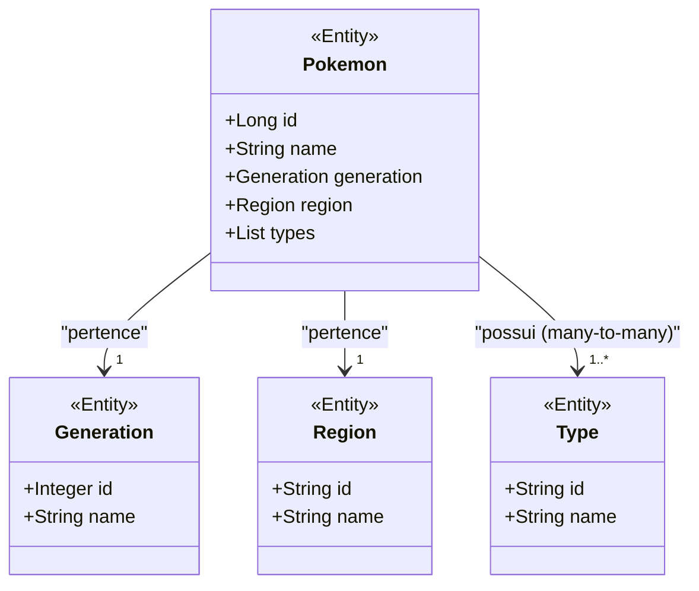

```mermaid
classDiagram

class Pokemon {
    <<Entity>>
    +Long id
    +String name
    +Generation generation
    +Region region
    +List<Type> types
}

class Generation {
    <<Entity>>
    +Integer id
    +String name
}

class Region {
    <<Entity>>
    +String id
    +String name
}

class Type {
    <<Entity>>
    +String id
    +String name
}

Pokemon --> "1" Generation : "pertence"
Pokemon --> "1" Region : "pertence"
Pokemon --> "1..*" Type : "possui (many-to-many)"

```